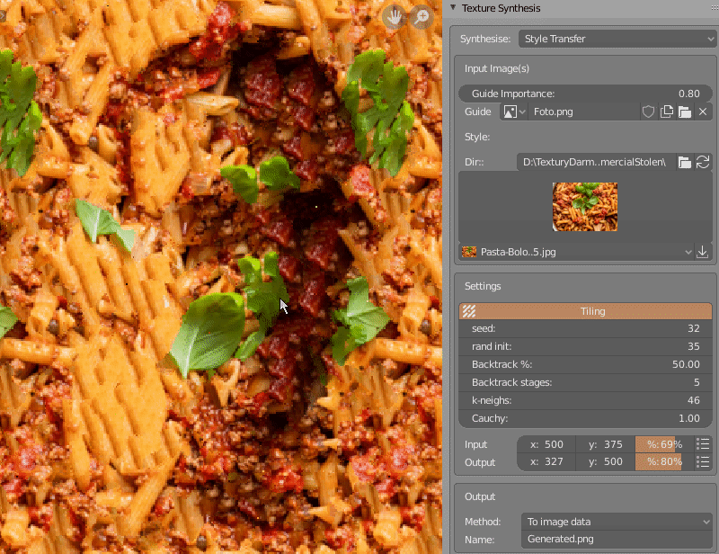

This blender is GUI for : [texture-synthesis](https://github.com/EmbarkStudios/texture-synthesis)

Github adds '-master' suffix to addon folder name. Remove this suffix so that addon works correctly. Folder name should then be: 
* texture_synthesis

After installing addon go to addon preferences and select directory where texture-synthesis.exe is installed.

Addon panel is located in IMAGE_EDITOR -> Right Sidebar -> Texture Synthesis panel.
